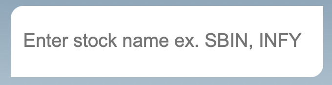
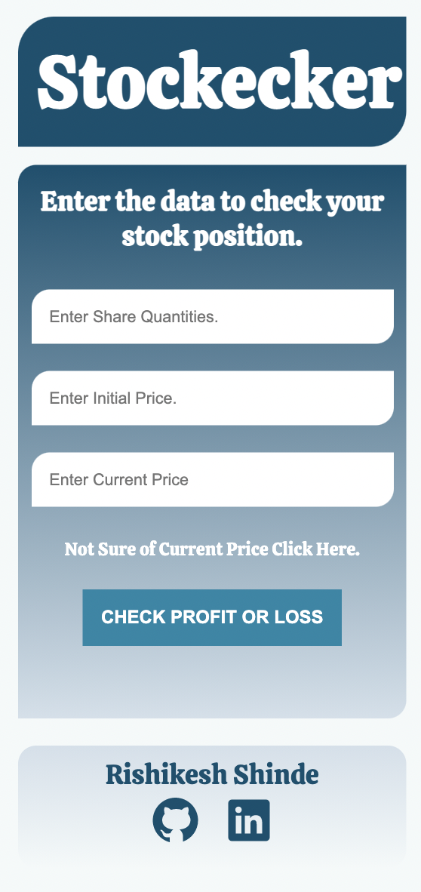

# **Stock Position Checker (Stockecker)**

This app checks position of your stock. You just have to give share quantities and initial buying price.

> ### How do I get current stock price?
>
> In case you don't know current price of your stock just click here

 

 and you will get this:

 

Now just enter the name of your stock for example, if you want the current price of `State Bank Of India stock` then type `SBIN` and you will get the last closing price in current price input box.

>### What about API?

The serverURL of API is:

    https://www.alphavantage.co/query?function=TIME_SERIES_DAILY_ADJUSTED&symbol=" +
        stockName +
        ".BSE&outputsize=full&apikey=demo

>### What else you would like to tell about this app?

Here are some things about this app that i would like to share:

1. This looks pretty on mobile phone also.

2. Tech Stack Used is `HTML`, `CSS`, `Javascript`.

>### Where do I can ckeckout all of this?

To visit the app just click [here]()